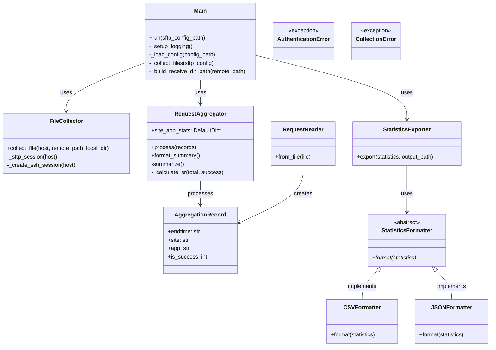

# クラス図

```mermaid
classDiagram
    class Main {
        +run(sftp_config_path)
        -_setup_logging()
        -_load_config(config_path)
        -_collect_files(sftp_config)
        -_build_receive_dir_path(remote_path)
    }

    class FileCollector {
        +collect_file(host, remote_path, local_dir)
        -_sftp_session(host)
        -_create_ssh_session(host)
    }

    class RequestReader {
        +from_file(file) $
    }

    class AggregationRecord {
        +endtime: str
        +site: str
        +app: str
        +is_success: int
    }

    class RequestAggregator {
        +site_app_stats: DefaultDict
        +process(records)
        +format_summary()
        -summarize()
        -_calculate_sr(total, success)
    }

    class StatisticsFormatter {
        <<abstract>>
        +format(statistics) *
    }

    class CSVFormatter {
        +format(statistics)
    }

    class JSONFormatter {
        +format(statistics)
    }

    class StatisticsExporter {
        +export(statistics, output_path)
    }

    class AuthenticationError {
        <<exception>>
    }

    class CollectionError {
        <<exception>>
    }

    StatisticsFormatter <|-- CSVFormatter: implements
    StatisticsFormatter <|-- JSONFormatter: implements
    StatisticsExporter --> StatisticsFormatter: uses
    RequestAggregator --> AggregationRecord: processes
    RequestReader --> AggregationRecord: creates
    Main --> FileCollector: uses
    Main --> RequestAggregator: uses
    Main --> StatisticsExporter: uses
```
