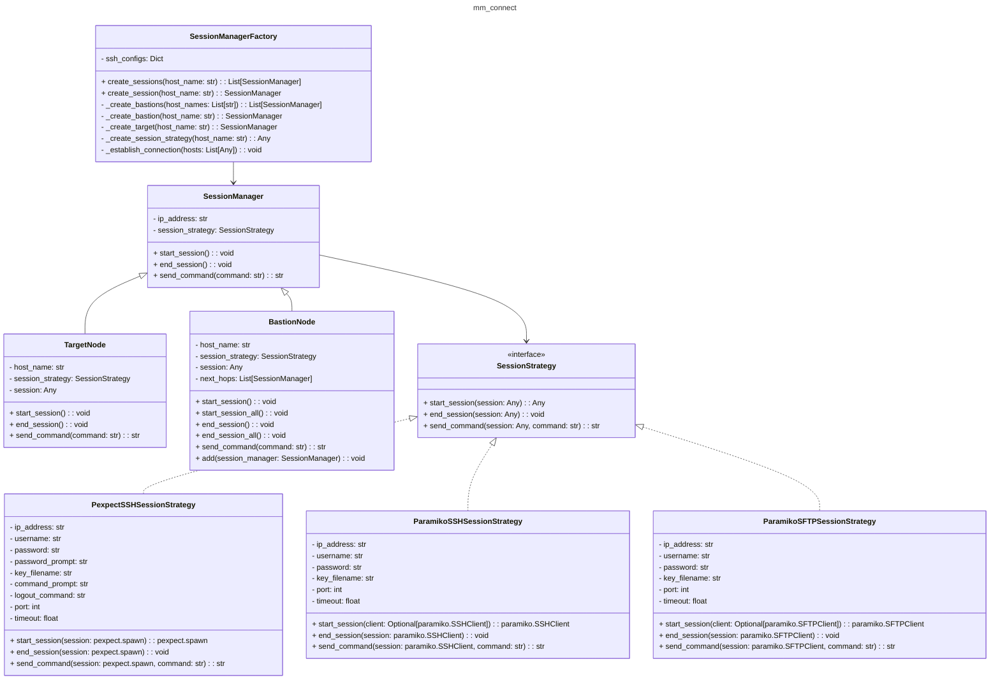

```mermaid
---
title: mm_connect
---
classDiagram
    class SessionManagerFactory {
        - ssh_configs: Dict
        + create_sessions(host_name: str): List[SessionManager]
        + create_session(host_name: str): SessionManager
        - _create_bastions(host_names: List[str]): List[SessionManager]
        - _create_bastion(host_name: str): SessionManager
        - _create_target(host_name: str): SessionManager
        - _create_session_strategy(host_name: str): Any
        - _establish_connection(hosts: List[Any]): void
    }

    class SessionManager {
        - ip_address: str
        - session_strategy: SessionStrategy
        + start_session(): void
        + end_session(): void
        + send_command(command: str): str
    }

    class TargetNode {
        - host_name: str
        - session_strategy: SessionStrategy
        - session: Any
        + start_session(): void
        + end_session(): void
        + send_command(command: str): str
    }

    class BastionNode {
        - host_name: str
        - session_strategy: SessionStrategy
        - session: Any
        - next_hops: List[SessionManager]
        + start_session(): void
        + start_session_all(): void
        + end_session(): void
        + end_session_all(): void
        + send_command(command: str): str
        + add(session_manager: SessionManager): void
    }

    class SessionStrategy {
        <<interface>>
        + start_session(session: Any): Any
        + end_session(session: Any): void
        + send_command(session: Any, command: str): str
    }

    class PexpectSSHSessionStrategy {
        - ip_address: str
        - username: str
        - password: str
        - password_prompt: str
        - key_filename: str
        - command_prompt: str
        - logout_command: str
        - port: int
        - timeout: float
        + start_session(session: pexpect.spawn): pexpect.spawn
        + end_session(session: pexpect.spawn): void
        + send_command(session: pexpect.spawn, command: str): str
    }

    class ParamikoSSHSessionStrategy {
        - ip_address: str
        - username: str
        - password: str
        - key_filename: str
        - port: int
        - timeout: float
        + start_session(client: Optional[paramiko.SSHClient]): paramiko.SSHClient
        + end_session(session: paramiko.SSHClient): void
        + send_command(session: paramiko.SSHClient, command: str): str
    }

    class ParamikoSFTPSessionStrategy {
        - ip_address: str
        - username: str
        - password: str
        - key_filename: str
        - port: int
        - timeout: float
        + start_session(client: Optional[paramiko.SFTPClient]): paramiko.SFTPClient
        + end_session(session: paramiko.SFTPClient): void
        + send_command(session: paramiko.SFTPClient, command: str): str
    }

    SessionManagerFactory --> SessionManager
    SessionManager <|-- TargetNode
    SessionManager <|-- BastionNode
    SessionManager --> SessionStrategy
    SessionStrategy <|.. PexpectSSHSessionStrategy
    SessionStrategy <|.. ParamikoSSHSessionStrategy
    SessionStrategy <|.. ParamikoSFTPSessionStrategy
```
